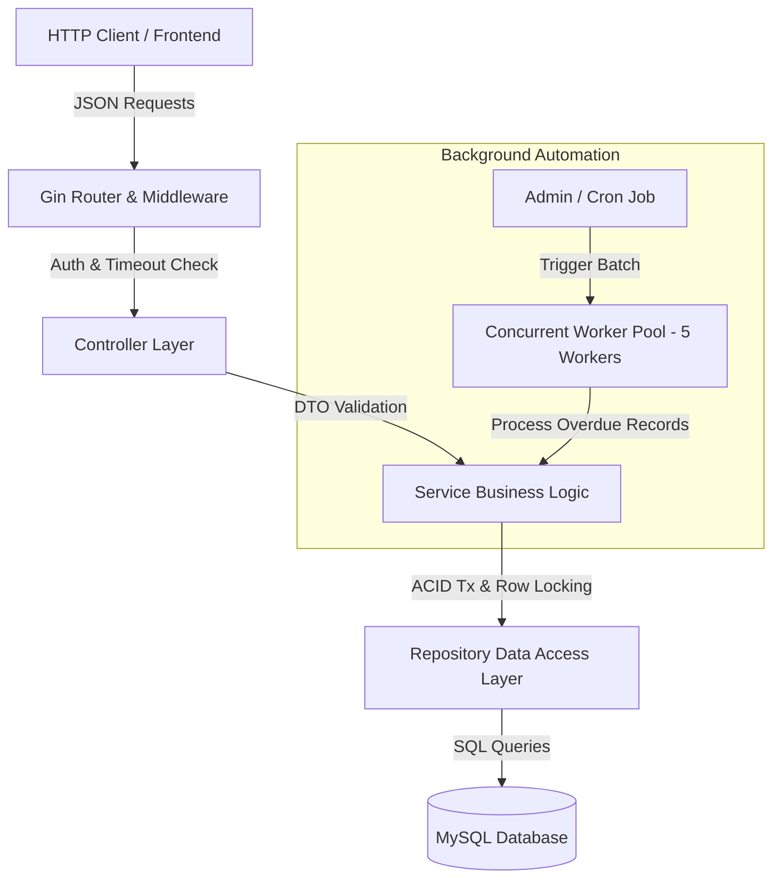
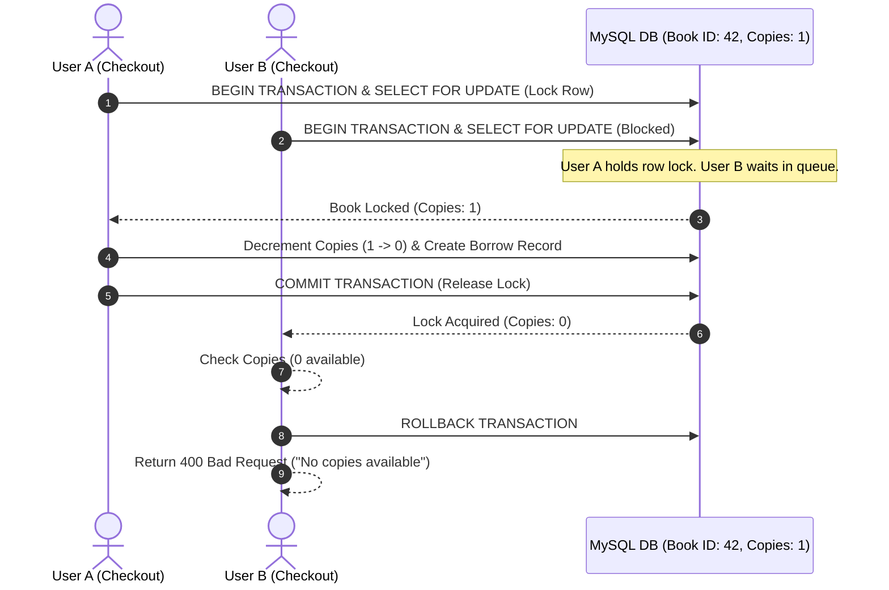

# 📚 Enterprise Library Management System REST API

[](https://golang.org/)
[](https://gin-gonic.com/)
[](https://gorm.io/)
[](https://www.mysql.com/)
[](LICENSE)

A high-performance, enterprise-grade RESTful API for modern library operations built using **Go (Golang)**, **Gin Web Framework**, **GORM**, and **MySQL**. Engineered following **Clean Layered Architecture** (Controller → Service → Repository), featuring **pessimistic row locking** (`SELECT ... FOR UPDATE`) to prevent race conditions during book checkout, and a **concurrent worker pool** for automated batch background processing.

---

## ✨ Key Features

- 🏛️ **Clean Layered Architecture**: Decoupled design with interface abstractions across Controllers, Services, and Repositories for maximum testability and maintainability.
- 🔒 **ACID Transactions & Race-Free Checkout**: Utilizes GORM database transactions paired with MySQL pessimistic row locking (`SELECT ... FOR UPDATE`) to guarantee atomic copy count updates without over-booking.
- ⚡ **Concurrent Worker Pool**: Automated batch processing of overdue borrow records using 5 concurrent worker goroutines with Go channels and atomic counters.
- 🔐 **Authentication & RBAC**: Secure password hashing with `bcrypt`, JWT authentication (`golang-jwt/jwt`), and Role-Based Access Control (`ADMIN` vs `MEMBER`).
- ⏱️ **Resilience Middleware**: Built-in 10-second global request timeout middleware to prevent thread starvation, alongside custom CORS configuration.
- 📊 **Real-Time Admin Analytics**: Comprehensive dashboard metrics tracking active borrowings, overdue counts, total users, available books, and completed returns.
- 📝 **Structured Logging & Input Validation**: Production-grade logging using `Logrus` and strict input schema validation via `go-playground/validator/v10`.

---

## 🏗️ Architecture & System Design

### Layered Architecture Flow



### Pessimistic Concurrency Control Flow



---

## 📁 Project Directory Structure

```text
library_management_backend/
├── app/                  # Application container & Dependency Injection (InitApp)
│   └── app.go
├── config/               # Database connection initialization & env config loader
│   └── config.go
├── constants/            # Role definitions & Borrow status constants
│   └── constants.go
├── controller/           # HTTP Request Handlers & DTO binding
│   ├── auth_controller.go
│   ├── book_controller.go
│   ├── borrow_controller.go
│   └── dashboard_controller.go
├── database/             # GORM MySQL driver config & schema auto-migration
│   └── database.go
├── dto/                  # Data Transfer Objects (Request/Response schemas)
│   ├── auth_dto.go
│   ├── book_dto.go
│   ├── borrow_dto.go
│   └── dashboard_dto.go
├── middleware/           # Auth JWT Middleware, Role RBAC & Request Timeout Middleware
│   ├── auth_middleware.go
│   ├── role_middleware.go
│   └── timeout_middleware.go
├── model/                # GORM Database Models (User, Book, BorrowRecord)
│   ├── book.go
│   ├── borrow_record.go
│   └── user.go
├── repository/           # Database Access Layer (SQL Queries & GORM locks)
│   ├── book_repository.go
│   ├── borrow_repository.go
│   └── user_repository.go
├── route/                # Gin Router Setup & Endpoint Registration
│   └── route.go
├── service/              # Business Logic Layer (ACID Transactions & Validations)
│   ├── auth_service.go
│   ├── book_service.go
│   ├── borrow_service.go
│   └── dashboard_service.go
├── utils/                # Response Builders, JWT Utilities, Password Hashing & Logger
│   ├── jwt_utils.go
│   ├── logger.go
│   ├── password_utils.go
│   ├── response_util.go
│   └── validator_util.go
└── workers/              # Concurrent Worker Pool for Batch Processing
    └── overdue_worker.go
```

---

## 🧰 Tech Stack & Dependencies

| Category | Technology / Library | Description |
|---|---|---|
| **Language** | [Go (Golang 1.25+)](https://golang.org/) | High-performance compiled language |
| **Web Framework** | [Gin v1.12.0](https://github.com/gin-gonic/gin) | Ultra-fast HTTP web framework |
| **ORM** | [GORM v1.31.2](https://gorm.io/) | Developer-friendly ORM library for Go |
| **Database** | [MySQL 8.0+](https://www.mysql.com/) | Relational Database Management System |
| **Authentication** | [golang-jwt/jwt/v5](https://github.com/golang-jwt/jwt) | JSON Web Token implementation |
| **Password Hashing** | [x/crypto/bcrypt](https://pkg.go.dev/golang.org/x/crypto/bcrypt) | Secure bcrypt password hashing |
| **Logging** | [Logrus v1.9.4](https://github.com/sirupsen/logrus) | Structured logger for Go |
| **Validation** | [Validator v10](https://github.com/go-playground/validator) | Struct & field validation |
| **Identifiers** | [Google UUID v1.6.0](https://github.com/google/uuid) | Universally Unique Identifiers generation |

---

## ⚙️ Environment Variables

Create a `.env` file in the root directory:

```env
# Server Configuration
PORT=8080

# Database Configuration
DB_HOST=127.0.0.1
DB_PORT=3306
DB_USER=root
DB_PASSWORD=your_mysql_password
DB_NAME=library_db

# Security & JWT Configuration
JWT_SECRET=super_secret_jwt_key_library_app
```

---

## 🚀 Quick Start & Local Setup

### Prerequisites

- **Go 1.25** or higher installed.
- **MySQL 8.0+** running locally or via Docker.

### 1. Clone & Navigate
```bash
git clone https://github.com/your-username/library_management_backend.git
cd library_management_backend
```

### 2. Configure Environment
Copy and customize `.env`:
```bash
cp .env.example .env
```

### 3. Initialize MySQL Database
Ensure your MySQL instance is active and create the database schema:
```sql
CREATE DATABASE IF NOT EXISTS library_db;
```

### 4. Install Dependencies
```bash
go mod download
```

### 5. Start Application
```bash
# Run server directly
go run .

# Run with custom env file
go run . -env custom.env
```
The server automatically runs GORM migrations and listens on `http://localhost:8080`.

---

## 📡 API Endpoints Reference

### 🔓 Public Endpoints

| Method | Endpoint | Description | Request Body |
|---|---|---|---|
| `POST` | `/health-check` | Server health check status | None |
| `POST` | `/user/register` | Register new user (`MEMBER` / `ADMIN`) | `RegisterUserRequest` |
| `POST` | `/user/login` | Authenticate user & receive JWT token | `LoginUserRequest` |
| `POST` | `/books/list` | Filter & paginate catalog | `GetBooksListRequest` |
| `POST` | `/books/details` | Retrieve book details by UUID | `GetBookDetailsRequest` |

### 🔒 Member Endpoints (Requires Auth Bearer Token)

| Method | Endpoint | Description | Request Headers |
|---|---|---|---|
| `POST` | `/borrow/create` | Borrow a book (Checks 3 max limit) | `Authorization`, `auth_user_id` |
| `POST` | `/borrow/return` | Return a borrowed book | `Authorization`, `auth_user_id` |
| `POST` | `/borrow/my-borrowings` | View personal borrowing history | `Authorization`, `auth_user_id` |
| `POST` | `/my-borrowings` | Alternative endpoint for borrowing history | `Authorization`, `auth_user_id` |

### 🛡️ Admin Endpoints (Requires Admin Bearer Token)

| Method | Endpoint | Description | Allowed Role |
|---|---|---|---|
| `POST` | `/books/create` | Add new book to catalog | `ADMIN` |
| `POST` | `/books/update` | Update existing book info | `ADMIN` |
| `POST` | `/books/delete` | Soft delete book record | `ADMIN` |
| `POST` | `/admin/dashboard` | Fetch system analytics stats | `ADMIN` |
| `POST` | `/admin/process-overdue` | Trigger background worker batch update | `ADMIN` |

---

## 💻 Sample cURL Requests

### 1. Register User
```bash
curl -X POST http://localhost:8080/user/register \
  -H "Content-Type: application/json" \
  -d '{
    "name": "John Doe",
    "email": "john@example.com",
    "password": "Password123!",
    "role": "MEMBER"
  }'
```

### 2. User Login
```bash
curl -X POST http://localhost:8080/user/login \
  -H "Content-Type: application/json" \
  -d '{
    "email": "john@example.com",
    "password": "Password123!"
  }'
```

### 3. Create Book (Admin Only)
```bash
curl -X POST http://localhost:8080/books/create \
  -H "Authorization: Bearer <ADMIN_JWT_TOKEN>" \
  -H "auth_user_id: 1" \
  -H "Content-Type: application/json" \
  -d '{
    "title": "Clean Architecture in Go",
    "author": "Robert C. Martin",
    "isbn": "978-0134494166",
    "category": "Software Engineering",
    "total_copies": 5
  }'
```

### 4. Borrow Book
```bash
curl -X POST http://localhost:8080/borrow/create \
  -H "Authorization: Bearer <MEMBER_JWT_TOKEN>" \
  -H "auth_user_id: 2" \
  -H "Content-Type: application/json" \
  -d '{
    "book_uuid": "<BOOK_UUID>"
  }'
```

### 5. Return Book
```bash
curl -X POST http://localhost:8080/borrow/return \
  -H "Authorization: Bearer <MEMBER_JWT_TOKEN>" \
  -H "auth_user_id: 2" \
  -H "Content-Type: application/json" \
  -d '{
    "borrow_record_uuid": "<BORROW_RECORD_UUID>"
  }'
```

### 6. Trigger Overdue Worker Batch Processing
```bash
curl -X POST http://localhost:8080/admin/process-overdue \
  -H "Authorization: Bearer <ADMIN_JWT_TOKEN>" \
  -H "auth_user_id: 1"
```

---

## ⚡ High-Throughput Batch Worker Pool

The project features an in-memory concurrent background worker engine (`workers/overdue_worker.go`) designed for efficient batch updates:

- **Fan-Out Architecture**: Spawns **5 worker goroutines** listening on a Go channel populated with overdue borrow records (`due_date < NOW() && status = 'BORROWED'`).
- **Atomic Operations**: Utilizes `sync/atomic` primitives (`AddInt64`) to compute total processed vs failed records safely across goroutines without lock contention.
- **Synchronization**: Coordinates completion using `sync.WaitGroup` to guarantee non-blocking execution while delivering exact execution stats in the admin API response.

---

## 🧪 Build & Test Verification

```bash
# Compile and build binary
go build ./...

# Run code format verification
go fmt ./...

# Run static analysis
go vet ./...
```

---

## 📄 License

This project is open-source software licensed under the **MIT License**.
